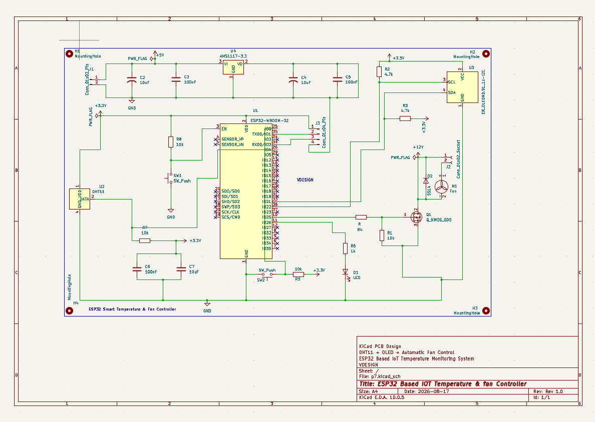
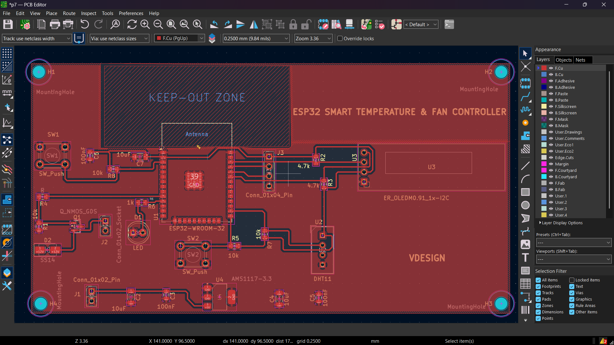
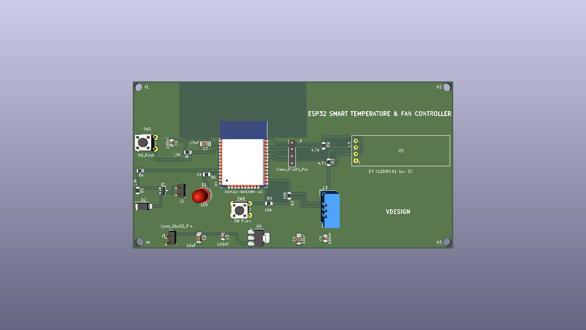

# ESP32 Smart Temperature & Fan Controller

## Project Overview

ESP32 based Smart Temperature and Fan Controller PCB designed using KiCad.

The system uses a DHT11 sensor for temperature monitoring and controls a 12V DC fan using a MOSFET. An OLED display is used to display temperature information.

## Main Components

- ESP32-WROOM-32
- DHT11 Temperature Sensor
- 0.91-inch I2C OLED
- AMS1117-3.3V
- NMOS
- SS14 Diode
- 12V DC Fan
- LED
- Push Buttons

## PCB Design Process

Schematic Design  
→ Footprint Assignment  
→ Component Placement  
→ PCB Routing  
→ GND Zone  
→ DRC Check  
→ 3D PCB View  
→ Gerber Generation

## Tools

- KiCad
- KiCad Schematic Editor
- KiCad PCB Editor
- KiCad 3D Viewer
- Gerber Viewer

## Project Images

### Schematic

### PCB Routing

### 3D PCB View

## Project Files

This repository contains:

- KiCad schematic
- KiCad PCB layout
- KiCad project file
- Gerber files
- Drill files
- PCB design images

## Project Status

PCB design completed as a KiCad PCB Design Project.

## Author

Vishal Bodkhe
